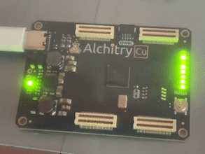

# Centurion

This directory contains an [HDL](https://en.wikipedia.org/wiki/Hardware_description_language) implementation of the [Centurion Minicomputer](https://github.com/Nakazoto/CenturionComputer/wiki).

The Centurion was an 8-bit minicomputer designed and built by Warrex Computer Corporation, headquartered in Richardson, Texas. The company operated from the mid 1970's into the mid 1980's, delivering approximately 1000 computers to customers in Texas, Oklahoma, and others. The computers were used for accounting and other business functions in medium sized companies.

The Centurion was made of almost entirely TTL MSI logic on a handful of PC boards in a single rack. Earlier models relied on magnetic core memory, later models used MOS memory up to 256 kB. It was technologically similar to the DEC VAX 11/780 or Data General Nova, but smaller and lower priced. Competition from even lower cost microcomputers, particularly the IBM XT and AT in the 1980's, led to decreased sales and the end of the line.

## Simulation

The [Verilog](https://en.wikipedia.org/wiki/Verilog) implementation was simulated with [Icarus Verilog](http://iverilog.icarus.com/), specifically, [Icarus Verilog for Windows](https://bleyer.org/icarus/).

The build process is straightforward:

```
> cd Verilog
> iverilog -o CPU6TestBench CPU6TestBench.v
> vvp CPU6TestBench
```

The simulation output is saved in the ```Verilog/vcd``` directory. It can be viewed using [GTK Wave](http://gtkwave.sourceforge.net/).

## Synthesis

[Project IceStorm](https://clifford.at/icestorm) open source tools were used for synthesis. Below is the very first program running on an [Alchitry Cu](https://alchitry.com/boards/cu) board with a [Lattice iCE40 HX8K](https://www.latticesemi.com/iCE40) FPGA:

```
ff02 80 00    // LDAL #00
ff04 01       // NOP
ff05 a1 5c 00 // STAL #5c00 (LEDPanel)
ff08 20 00    // INR AL, 1
ff0a 0e       // DLY 4.55 ms
ff0b 0e       // DLY 4.55 ms
ff0c 0e       // DLY 4.55 ms
ff0d 0e       // DLY 4.55 ms
ff0e 71 ff 05 // JMP #ff05
```

This is known to work on WSL Ubuntu running on Windows 11. USB support requires [usbipd](https://devblogs.microsoft.com/commandline/connecting-usb-devices-to-wsl) for device programming in WSL. To connect a USB device to WSL Ubuntu, the following commands must be executed from an **administrator** command prompt on Windows:

```
usbipd wsl list
usbipd wsl attach --busid <busid>
```

The device should appear in WSL Ubuntu using ```lsusb```.

Where busid is appropriate USB bus ID from the list command above.



This version is operating with a system clock of 20MHz, four times the clock rate of the original Centurion CPU6.

## Architecture

The CPU6 is an interesting design. It is based on the [AMD Am2900](https://en.wikipedia.org/wiki/AMD_Am2900) family of bit slice devices. The entire CPU fits on a single board, using two Am2901s to make an 8-bit ALU. The control unit is [microcoded](https://en.wikipedia.org/wiki/Microcode), using 2 Am2909 microsequencers, and 1 Am2911 microsequencer with a 2048 word x 56-bit microprogram stored in seven EPROMs. It is typical of minicomputers of that era. Discrete CPUs based on the Am2900 family were soon superceded by fully integrated VLSI CPUs, such as the [Intel 8086](https://en.wikipedia.org/wiki/Intel_8086), [Motorola 68000](https://en.wikipedia.org/wiki/Motorola_68000), and numerous others.

Below is a sample microcode execution trace. The marker shows the beginning of the very first instruction after reset. It executes a NOP (no operation) and then DLY (delay 4.55 ms).


## Datapath

Below is the CPU data path with enables for busses and registers. The enables are controlled by the microcode word at the output of the pipeline register.


### Links

 * [Schematics](https://github.com/Meisaka/CenMiniCom)
 * [Schematics and Microcode](https://github.com/sjsoftware/centurion-cpu6)
 