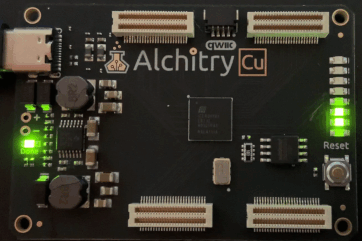

# Centurion Hardware Resurrection

This directory contains an [FPGA](https://en.wikipedia.org/wiki/Field-programmable_gate_array) implementation of the [Centurion Minicomputer](https://github.com/Nakazoto/CenturionComputer/wiki).

The Centurion was an 8-bit minicomputer designed and built by Warrex Computer Corporation, headquartered in Richardson, Texas. The company operated from the mid 1970's into the mid 1980's, delivering approximately 1000 computers to customers in Texas, Oklahoma, and others. The computers were used for accounting and business functions in medium sized companies.

The Centurion was made of almost entirely TTL MSI logic on a handful of PC boards in a single rack. Earlier models relied on magnetic core memory, later models used MOS memory up to 256 kB. It was technologically similar to the DEC VAX 11/780 or Data General Nova, but smaller and lower priced. Competition from even lower cost microcomputers, particularly the IBM XT and AT in the 1980's, led to decreased sales and the end of the line.

Below is a picure of CPU6 board. Notice the prominent [Am2900 series](https://en.wikipedia.org/wiki/AMD_Am2900) bit slice components in center of the board. The HDL design described below implements the behavior of each of these components. The row of seven 2kx8 [EPROMs](https://en.wikipedia.org/wiki/EPROM) in the upper left contain about 2048 words of [microcode](https://en.wikipedia.org/wiki/Microcode), which is the true personality of the [CPU6 instruction set](https://github.com/Nakazoto/CenturionComputer/wiki/Instructions).


## Simulation

The [Verilog](https://en.wikipedia.org/wiki/Verilog) implementation was simulated with [Icarus Verilog](http://iverilog.icarus.com/), specifically, [Icarus Verilog for Windows](https://bleyer.org/icarus/).

The build process is straightforward:

```
> cd Verilog
> iverilog -o CPU6TestBench CPU6TestBench.v
> vvp CPU6TestBench
```

The simulation output is saved in the ```Verilog/vcd``` directory. It can be viewed using [GTK Wave](http://gtkwave.sourceforge.net/).

Simulation supports several trace levels for debugging purposes. Uncomment any of the following macros in CPU6TestBench.v to enable tracing:

```
// `define TRACE_I // trace instructions
// `define TRACE_WR // trace bus writes
// `define TRACE_RD // trace bus reads
// `define TRACE_UC // trace microcode
```

## Synthesis

[Project IceStorm](https://clifford.at/icestorm) open source tools were used for synthesis. Below is a demonstration program running on an [Alchitry Cu](https://alchitry.com/boards/cu) FPGA board containing a [Lattice iCE40 HX8K](https://www.latticesemi.com/iCE40):



The iCE40 HX8K FPGA has 32 4kBit synchronous RAM blocks. Most of the block RAM is used for microcode (2k x 56-bit). Storing microcode in internal block RAM reduces the need for external storage, which is convenient. One RAM block is used for register RAM (256 bytes) and one more is used for a small amount of memory (instructions and data). External RAM will be connected in the future, limited internal block RAM is available for testing.

This version is operating with a CPU clock of 5MHz, which is the estimated the clock rate of the original Centurion CPU6. This design can operate as high as 40MHz, many times faster the original.

Synthesis is known to work on [WSL](https://docs.microsoft.com/en-us/windows/wsl/install) Ubuntu running on Windows 11. The following command will perform synthesis:

```
cd Verilog
make
```

USB support on WSL requires [usbipd](https://devblogs.microsoft.com/commandline/connecting-usb-devices-to-wsl) for device programming in WSL. To connect a USB device to WSL Ubuntu, the following commands must be executed from an **administrator** command prompt on Windows:

```
usbipd wsl list
```
```
usbipd wsl attach --busid <busid>
```

Where busid is the appropriate USB bus ID from the wsl list command above. The device should appear in WSL Ubuntu using ```lsusb```.

The board can be programmed from WSL Ubuntu using:

```
make sudo-prog
```

Resource utilization and timing analysis is below:

```
Info: Device utilisation:
Info:            ICESTORM_LC:  1204/ 7680    15%
Info:           ICESTORM_RAM:    30/   32    93%
Info:                  SB_IO:     9/  256     3%
Info:                  SB_GB:     5/    8    62%
Info:           ICESTORM_PLL:     1/    2    50%
Info:            SB_WARMBOOT:     0/    1     0%

Info: Max frequency for clock      'clock_$glb_clk': 40.37 MHz (PASS at 12.00 MHz)
Info: Max frequency for clock 'clock20MHz_$glb_clk': 655.31 MHz (PASS at 12.00 MHz)

Info: Max delay posedge clock_$glb_clk -> <async>: 2.19 ns
```

## Architecture

The CPU6 is an interesting design. It is based on the [AMD Am2900](https://en.wikipedia.org/wiki/AMD_Am2900) family of bit slice devices. The entire CPU fits on a single board, using two Am2901s to make an 8-bit ALU. The control unit is [microcoded](https://en.wikipedia.org/wiki/Microcode), using 2 Am2909 microsequencers, and 1 Am2911 microsequencer with a 2048 word x 56-bit microprogram stored in seven EPROMs. It is typical of minicomputers of that era. Discrete CPUs based on the Am2900 family were soon superceded by fully integrated VLSI CPUs, such as the [Intel 8086](https://en.wikipedia.org/wiki/Intel_8086), [Motorola 68000](https://en.wikipedia.org/wiki/Motorola_68000), and numerous others.

Below is a sample microcode execution trace. The marker shows the beginning of the very first instruction after reset. It executes a NOP (no operation) and then DLY (delay 4.55 ms).


## Datapath

Below is the CPU data path with enables for busses and registers. The enables are controlled by the microcode word at the output of the pipeline register.


## Status

Development is in progress. Most 8 and 16 bit instructions are known to work. A few instructions do not operate correctly.

### Links

 * [Schematics](https://github.com/Meisaka/CenMiniCom)
 * [Schematics and Microcode](https://github.com/sjsoftware/centurion-cpu6)
